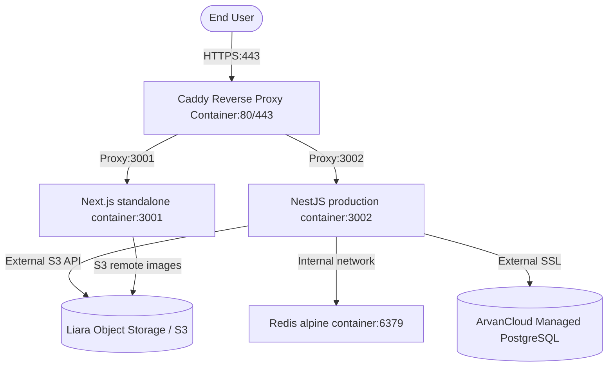

# Deployment & Refactoring Roadmap

This document outlines the architecture, deployment plan, and active checklist of tasks to prepare the Rayaan E-Commerce monorepo for production deployment on a real Linux VPS (ArvanCloud) mapped behind Caddy reverse proxy.

---

## 1. System Architecture

Below is the production container deployment structure on the VPS:

---

## 2. VPS & Storage Deployment Plan

*   **Operating System:** Ubuntu 24.04 LTS VPS (ArvanCloud).
*   **Reverse Proxy:** Caddy container managing automatic SSL certificates (HTTPS via Let's Encrypt) and routing traffic.
*   **Database:** ArvanCloud managed PostgreSQL (secure connection, auto-backups).
*   **Cache:** Redis running as a Docker service on the VPS with persistence enabled (`--appendonly yes`).
*   **Storage:** Liara Object Storage (S3-compatible) hosting product images, banners, and category thumbnails.

---

## 3. Active Task Checklist

### Phase 1: Project Initialization & Roadmap
- [x] Analyze codebase structure (NestJS backend, Next.js frontend, Docker files).
- [x] Create root `Roadmap.md` detailing the deployment model and architecture.
- [x] Align on the implementation steps.

### Phase 2: Guest-to-User Cart Migration (Sync)
- [ ] **Backend:** Implement `mergeCart` method in NestJS `CartService` to merge guest cart items with user's cart in database/Redis.
- [ ] **Backend:** Add `POST /cart/merge` endpoint in `CartController` (protected under authentication).
- [ ] **Backend:** Define and validate `MergeCartDto` with class-validator.
- [ ] **Frontend:** Modify login form flow to collect guest items from local storage and post to `/cart/merge` upon successful authentication (OTP verify, direct login, or registration complete).
- [ ] **Frontend:** Clean local storage guest cart (`cart_snapshot_v1`) upon successful merge and refresh TanStack Query cart cache.

### Phase 3: Long-Lived Session (1-Week Auth)
- [ ] **Backend:** Update NestJS JWT configurations (`jwt.config.ts`) and token helper (`auth-token.helper.ts`) to set token lifespan to exactly 7 days (`expiresIn: '7d'`).
- [ ] **Frontend:** Ensure the Next.js session cookie/token handling uses `maxAge` and `expires` attributes calculated precisely for 7 days, utilizing secure, `httpOnly`, and `sameSite: 'lax'` production cookie tokens.

### Phase 4: Frontend Performance Optimization
- [ ] **Lazy Loading:** Apply dynamic imports (`next/dynamic`) to deferred/heavy components (e.g. `CartDropdown` in `Header`, and `ProductQuickView` in `ProductCard`) to reduce initial JS chunk sizes.
- [ ] **Image Optimization:** Standardize standard Next.js `<Image />` component usage. Add remote patterns and AVIF/WebP formats to `next.config.ts`.
- [ ] **Sharp Integration:** Install `sharp` in `apps/frontend` to enable highly optimized image resizing in Next.js standalone container.

### Phase 5: Production Dockerfiles & Compose
- [ ] **Next.js Dockerfile:** Optimize multi-stage standalone build (aiming for < 150MB image).
- [ ] **NestJS Dockerfile:** Optimize production multi-stage build, eliminating devDependencies in runner.
- [ ] **Docker Compose:** Refactor `docker-compose.yml` to securely run backend, frontend, and redis, ready to be reverse proxied by host Nginx.
