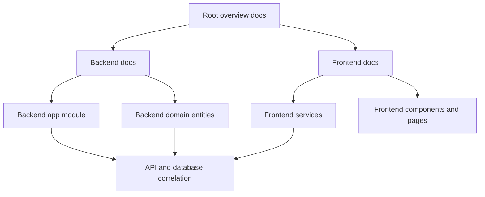

# Project Structure Map

## Overview
This repository is a monorepo for the Rayaan e-commerce platform.

- Root workspace orchestration lives in [package.json](package.json)
- Backend application lives in [apps/backend](apps/backend)
- Frontend application lives in [apps/frontend](apps/frontend)
- Cross-project planning and architecture docs live mostly in root-level markdown files such as [BACKEND-IMPLEMENTATION-GUIDE.md](BACKEND-IMPLEMENTATION-GUIDE.md), [FRONTEND-ARCHITECTURE.md](FRONTEND-ARCHITECTURE.md), [API-CONTRACTS.md](API-CONTRACTS.md), [DATABASE-SCHEMA.md](DATABASE-SCHEMA.md), [COMPONENTS_MAP.md](COMPONENTS_MAP.md), and [PAGES_MAP.md](PAGES_MAP.md)

## High-Level Structure

```text
.
├── package.json
├── apps/
│   ├── backend/
│   └── frontend/
├── docker/
├── packages/
└── *.md
```

## Root Files and What They Are For

### Workspace and package management
- [package.json](package.json): root monorepo scripts for running frontend and backend together or separately
- [pnpm-workspace.yaml](pnpm-workspace.yaml): workspace package boundaries
- [pnpm-lock.yaml](pnpm-lock.yaml): pnpm lockfile
- [package-lock.json](package-lock.json): npm lockfile, likely present from mixed package manager usage
- [nest-cli.json](nest-cli.json): Nest CLI configuration for backend tooling

### Root architecture and planning docs
- [BACKEND-IMPLEMENTATION-GUIDE.md](BACKEND-IMPLEMENTATION-GUIDE.md): intended backend architecture using Clean Architecture plus DDD-lite. This is more of a target design document than an exact mirror of the current backend codebase
- [FRONTEND-ARCHITECTURE.md](FRONTEND-ARCHITECTURE.md): frontend stack and architectural rules for the Next.js app
- [API-CONTRACTS.md](API-CONTRACTS.md): contract-first API design, request and response shapes, auth rules, pagination, and endpoint expectations
- [DATABASE-SCHEMA.md](DATABASE-SCHEMA.md): database design reference for PostgreSQL tables, fields, and domain boundaries
- [COMPONENTS_MAP.md](COMPONENTS_MAP.md): frontend component taxonomy, especially the UI layer and component usage rules
- [PAGES_MAP.md](PAGES_MAP.md): intended Next.js App Router page map and route responsibilities
- [CONFIG_MAP.md](CONFIG_MAP.md): likely configuration reference map
- [CORE_LIBRARIES_MAP.md](CORE_LIBRARIES_MAP.md): likely explanation of major libraries and where they are used
- [DOMAIN-MODELS.md](DOMAIN-MODELS.md): likely domain-level business model reference
- [IMPLEMENTATION_CHECKLIST.md](IMPLEMENTATION_CHECKLIST.md): implementation tracking checklist
- [MEDIA_IMPLEMENTATION_CHECKLIST.md](MEDIA_IMPLEMENTATION_CHECKLIST.md): media-specific implementation tracking
- [INTEGRATION-COMPLETE.md](INTEGRATION-COMPLETE.md): integration status summary
- [1-tr.md](1-tr.md): custom project note, likely ad hoc planning or translation content

## Backend App Map

### Backend purpose
The backend in [apps/backend](apps/backend) is a NestJS modular monolith using TypeORM, PostgreSQL, Redis, JWT auth, and domain-based modules.

Key evidence:
- scripts and dependencies in [apps/backend/package.json](apps/backend/package.json)
- module wiring in [apps/backend/src/app.module.ts](apps/backend/src/app.module.ts)
- operational docs in [apps/backend/README.md](apps/backend/README.md), [apps/backend/API-DOCUMENTATION.md](apps/backend/API-DOCUMENTATION.md), [apps/backend/QUICK-START.md](apps/backend/QUICK-START.md), [apps/backend/DEPLOYMENT-GUIDE.md](apps/backend/DEPLOYMENT-GUIDE.md), and [apps/backend/TESTING-GUIDE.md](apps/backend/TESTING-GUIDE.md)

### Important backend top-level files
- [apps/backend/README.md](apps/backend/README.md): main backend handbook, features, setup, API overview, and project structure
- [apps/backend/QUICK-START.md](apps/backend/QUICK-START.md): fastest path to run the backend locally or with Docker
- [apps/backend/API-DOCUMENTATION.md](apps/backend/API-DOCUMENTATION.md): detailed implemented API reference
- [apps/backend/API-USAGE-GUIDE.md](apps/backend/API-USAGE-GUIDE.md): practical API usage examples
- [apps/backend/DEPLOYMENT-GUIDE.md](apps/backend/DEPLOYMENT-GUIDE.md): production deployment instructions
- [apps/backend/TESTING-GUIDE.md](apps/backend/TESTING-GUIDE.md): testing strategy and commands
- [apps/backend/EXECUTIVE-SUMMARY.md](apps/backend/EXECUTIVE-SUMMARY.md): production-readiness summary
- [apps/backend/PRODUCTION-READINESS-CHECKLIST.md](apps/backend/PRODUCTION-READINESS-CHECKLIST.md): deployment and readiness checklist
- [apps/backend/CHANGELOG.md](apps/backend/CHANGELOG.md): backend change history
- [apps/backend/.env.example](apps/backend/.env.example): environment variable template
- [apps/backend/docker-compose.dev.yml](apps/backend/docker-compose.dev.yml): local DB and Redis support
- [apps/backend/docker-compose.yml](apps/backend/docker-compose.yml): production-like container stack
- [apps/backend/Dockerfile](apps/backend/Dockerfile): backend container build

### Backend source structure

```text
apps/backend/src/
├── app.module.ts
├── main.ts
├── common/
├── config/
├── database/
├── domains/
├── health/
├── migrations/
├── providers/
└── shared/
```

### Backend source folders and responsibilities
- [apps/backend/src/main.ts](apps/backend/src/main.ts): Nest application bootstrap entry point
- [apps/backend/src/app.module.ts](apps/backend/src/app.module.ts): root dependency composition. Registers config, TypeORM, cache, throttling, Redis, and all domain modules
- [apps/backend/src/common](apps/backend/src/common): cross-cutting HTTP and framework concerns
  - decorators in [apps/backend/src/common/decorators](apps/backend/src/common/decorators)
  - guards in [apps/backend/src/common/guards](apps/backend/src/common/guards)
  - filters in [apps/backend/src/common/filters](apps/backend/src/common/filters)
  - interceptors in [apps/backend/src/common/interceptors](apps/backend/src/common/interceptors)
  - middleware in [apps/backend/src/common/middleware](apps/backend/src/common/middleware)
  - pipes in [apps/backend/src/common/pipes](apps/backend/src/common/pipes)
- [apps/backend/src/config](apps/backend/src/config): environment loading, validation, database config, JWT config, Redis config
- [apps/backend/src/database](apps/backend/src/database): seeders and database bootstrap helpers
- [apps/backend/src/migrations](apps/backend/src/migrations): TypeORM migrations for schema evolution
- [apps/backend/src/health](apps/backend/src/health): liveness and readiness endpoints
- [apps/backend/src/providers](apps/backend/src/providers): external provider integrations such as SMS
- [apps/backend/src/shared](apps/backend/src/shared): reusable infrastructure modules such as Redis and storage

### Backend domain modules
The actual backend code is organized by domain modules under [apps/backend/src/domains](apps/backend/src/domains). This is important because it differs from the idealized structure in [BACKEND-IMPLEMENTATION-GUIDE.md](BACKEND-IMPLEMENTATION-GUIDE.md).

#### Auth and users
- [apps/backend/src/domains/auth](apps/backend/src/domains/auth): authentication flows, DTOs, JWT strategy, OTP and login endpoints
- [apps/backend/src/domains/users](apps/backend/src/domains/users): user profile and user entity management
- [apps/backend/src/domains/users/entities/user.entity.ts](apps/backend/src/domains/users/entities/user.entity.ts): maps the `users` table and defines user role and status enums

#### Catalog and product data
There are two overlapping catalog areas in the current codebase.

- [apps/backend/src/domains/products](apps/backend/src/domains/products): main product domain with product, variant, inventory, brand, and tag entities plus CRUD logic
- [apps/backend/src/domains/categories](apps/backend/src/domains/categories): standalone categories module
- [apps/backend/src/domains/catalog](apps/backend/src/domains/catalog): an additional catalog-oriented module that overlaps conceptually with products and categories

This suggests the codebase has evolved and may contain both an older catalog module and newer split modules.

Important entity files:
- [apps/backend/src/domains/products/entities/product.entity.ts](apps/backend/src/domains/products/entities/product.entity.ts): core product record, linked to category, brand, variants, and tags
- [apps/backend/src/domains/products/entities/product-variant.entity.ts](apps/backend/src/domains/products/entities/product-variant.entity.ts): SKU-level purchasable variant with price and inventory relation
- [apps/backend/src/domains/products/entities/inventory-stock.entity.ts](apps/backend/src/domains/products/entities/inventory-stock.entity.ts): stock tracking per variant
- [apps/backend/src/domains/products/entities/brand.entity.ts](apps/backend/src/domains/products/entities/brand.entity.ts): brand model
- [apps/backend/src/domains/products/entities/tag.entity.ts](apps/backend/src/domains/products/entities/tag.entity.ts): tag model
- [apps/backend/src/domains/categories/entities/category.entity.ts](apps/backend/src/domains/categories/entities/category.entity.ts): category model used by the active categories module

#### Commerce flow
- [apps/backend/src/domains/cart](apps/backend/src/domains/cart): Redis-backed shopping cart logic
- [apps/backend/src/domains/orders](apps/backend/src/domains/orders): order creation and order lifecycle
- [apps/backend/src/domains/payments](apps/backend/src/domains/payments): payment initiation, verification, and provider integrations
- [apps/backend/src/domains/campaign](apps/backend/src/domains/campaign): campaigns and product attachments for promotions

Important entity files:
- [apps/backend/src/domains/orders/entities/order.entity.ts](apps/backend/src/domains/orders/entities/order.entity.ts): order aggregate with user relation, status, payment reference, and order items
- [apps/backend/src/domains/payments/entities/payment.entity.ts](apps/backend/src/domains/payments/entities/payment.entity.ts): payment persistence model

#### Content and media
- [apps/backend/src/domains/media](apps/backend/src/domains/media): uploaded media records and media management
- [apps/backend/src/domains/banners](apps/backend/src/domains/banners): banner content management
- [apps/backend/src/domains/blogs](apps/backend/src/domains/blogs): blog content management
- [apps/backend/src/domains/media/entities/media.entity.ts](apps/backend/src/domains/media/entities/media.entity.ts): media table mapping with type, usage, entity linkage, dimensions, and metadata

#### Taxonomy and merchandising
- [apps/backend/src/domains/brands](apps/backend/src/domains/brands): brand CRUD endpoints and service layer
- [apps/backend/src/domains/tags](apps/backend/src/domains/tags): tag CRUD endpoints and service layer

### Backend architecture reality vs documentation
There is a useful distinction:

- [BACKEND-IMPLEMENTATION-GUIDE.md](BACKEND-IMPLEMENTATION-GUIDE.md) describes a stricter Clean Architecture plus DDD-lite target with `core`, `application`, `infrastructure`, and `presentation` layers
- the current implementation in [apps/backend/src](apps/backend/src) is a practical NestJS modular monolith organized mostly by domain folders with controllers, services, repositories, DTOs, and entities colocated

So the guide explains the intended architectural direction, while the code shows the current implemented structure.

## Frontend App Map

### Frontend purpose
The frontend in [apps/frontend](apps/frontend) is a Next.js App Router application using TypeScript, Tailwind, React Query, Zustand, Axios, and a large UI component layer.

Key evidence:
- dependencies in [apps/frontend/package.json](apps/frontend/package.json)
- architecture notes in [FRONTEND-ARCHITECTURE.md](FRONTEND-ARCHITECTURE.md)
- route planning in [PAGES_MAP.md](PAGES_MAP.md)
- component planning in [COMPONENTS_MAP.md](COMPONENTS_MAP.md)
- integration notes in [apps/frontend/FRONTEND-BACKEND-INTEGRATION.md](apps/frontend/FRONTEND-BACKEND-INTEGRATION.md)

### Frontend top-level folders

```text
apps/frontend/src/
├── app/
├── components/
├── hooks/
├── lib/
├── providers/
├── services/
├── stores/
├── styles/
├── types/
└── utils/
```

### Frontend folder responsibilities
- [apps/frontend/src/app](apps/frontend/src/app): Next.js App Router pages, layouts, route groups, and page entry files
- [apps/frontend/src/components](apps/frontend/src/components): reusable UI and feature components
- [apps/frontend/src/hooks](apps/frontend/src/hooks): custom React hooks
- [apps/frontend/src/lib](apps/frontend/src/lib): shared frontend utilities and framework setup
- [apps/frontend/src/providers](apps/frontend/src/providers): React context and app-level providers
- [apps/frontend/src/services](apps/frontend/src/services): API service layer wrapping backend endpoints
- [apps/frontend/src/stores](apps/frontend/src/stores): Zustand client state stores
- [apps/frontend/src/styles](apps/frontend/src/styles): global CSS and styling entry points
- [apps/frontend/src/types](apps/frontend/src/types): shared TypeScript types and enums

### Frontend service and data flow
- [apps/frontend/src/services/api-client.ts](apps/frontend/src/services/api-client.ts): central Axios client with base URL and auth/error interceptors
- [apps/frontend/src/services/index.ts](apps/frontend/src/services/index.ts): barrel export for service modules
- [apps/frontend/src/services/product.service.ts](apps/frontend/src/services/product.service.ts): product and category API wrapper used by product listing and detail flows
- [apps/frontend/src/stores/auth.store.ts](apps/frontend/src/stores/auth.store.ts): Zustand auth state for user and auth flow state
- [apps/frontend/src/lib/hooks/queries/useInfiniteProducts.ts](apps/frontend/src/lib/hooks/queries/useInfiniteProducts.ts): React Query infinite loading hook for product listing pages

### Frontend component layers
- [apps/frontend/src/components/ui](apps/frontend/src/components/ui): design-system primitives. According to [COMPONENTS_MAP.md](COMPONENTS_MAP.md), these should stay presentation-only and avoid business logic
- [apps/frontend/src/components/products](apps/frontend/src/components/products): product listing, cards, filters, sorting, and quick view
- [apps/frontend/src/components/product](apps/frontend/src/components/product): product detail page pieces such as gallery, info, tabs, and related products
- [apps/frontend/src/components/layout](apps/frontend/src/components/layout): header, footer, mega menu, search, and navigation
- [apps/frontend/src/components/checkout](apps/frontend/src/components/checkout): checkout flow UI
- [apps/frontend/src/components/dashboard](apps/frontend/src/components/dashboard): account dashboard UI
- [apps/frontend/src/components/shop](apps/frontend/src/components/shop): storefront presentation sections such as banners and stories

## Documentation Map by Purpose

### If you want to understand backend architecture
Start with:
1. [apps/backend/README.md](apps/backend/README.md)
2. [BACKEND-IMPLEMENTATION-GUIDE.md](BACKEND-IMPLEMENTATION-GUIDE.md)
3. [apps/backend/src/app.module.ts](apps/backend/src/app.module.ts)

### If you want to understand API shape and frontend-backend contracts
Start with:
1. [API-CONTRACTS.md](API-CONTRACTS.md)
2. [apps/backend/API-DOCUMENTATION.md](apps/backend/API-DOCUMENTATION.md)
3. [apps/frontend/FRONTEND-BACKEND-INTEGRATION.md](apps/frontend/FRONTEND-BACKEND-INTEGRATION.md)

### If you want to understand database and entities
Start with:
1. [DATABASE-SCHEMA.md](DATABASE-SCHEMA.md)
2. [apps/backend/src/domains/users/entities/user.entity.ts](apps/backend/src/domains/users/entities/user.entity.ts)
3. [apps/backend/src/domains/products/entities/product.entity.ts](apps/backend/src/domains/products/entities/product.entity.ts)
4. [apps/backend/src/domains/products/entities/product-variant.entity.ts](apps/backend/src/domains/products/entities/product-variant.entity.ts)
5. [apps/backend/src/domains/orders/entities/order.entity.ts](apps/backend/src/domains/orders/entities/order.entity.ts)
6. [apps/backend/src/domains/media/entities/media.entity.ts](apps/backend/src/domains/media/entities/media.entity.ts)

### If you want to understand frontend structure
Start with:
1. [FRONTEND-ARCHITECTURE.md](FRONTEND-ARCHITECTURE.md)
2. [PAGES_MAP.md](PAGES_MAP.md)
3. [COMPONENTS_MAP.md](COMPONENTS_MAP.md)
4. [apps/frontend/src/services/api-client.ts](apps/frontend/src/services/api-client.ts)
5. [apps/frontend/src/services/product.service.ts](apps/frontend/src/services/product.service.ts)

## Notable mismatches and observations

### 1. Backend guide vs actual backend code
The planned structure in [BACKEND-IMPLEMENTATION-GUIDE.md](BACKEND-IMPLEMENTATION-GUIDE.md) is more layered than the current implementation. The current code is still cleanly modular, but not split into the exact `domain`, `application`, `infrastructure`, and `presentation` folders described in the guide.

### 2. Frontend architecture doc vs installed libraries
[FRONTEND-ARCHITECTURE.md](FRONTEND-ARCHITECTURE.md) says Base UI and not Shadcn or Radix, but [COMPONENTS_MAP.md](COMPONENTS_MAP.md) and [apps/frontend/package.json](apps/frontend/package.json) show strong shadcn-style and Radix-style patterns. So the docs may reflect an earlier or mixed direction.

### 3. Product data flow mismatch in frontend
[apps/frontend/src/services/product.service.ts](apps/frontend/src/services/product.service.ts) returns `data.data` as a paginated response, but [apps/frontend/src/lib/hooks/queries/useInfiniteProducts.ts](apps/frontend/src/lib/hooks/queries/useInfiniteProducts.ts) still expects another nested `data` layer and comments that the response is double-wrapped. This likely indicates the hook and service are out of sync.

### 4. Catalog overlap in backend
Both [apps/backend/src/domains/catalog](apps/backend/src/domains/catalog) and the split modules [apps/backend/src/domains/products](apps/backend/src/domains/products) plus [apps/backend/src/domains/categories](apps/backend/src/domains/categories) exist. This may represent a transition or partial refactor.

## Suggested reading order



## Practical file-by-file orientation

### Start here for the whole project
- [package.json](package.json)
- [BACKEND-IMPLEMENTATION-GUIDE.md](BACKEND-IMPLEMENTATION-GUIDE.md)
- [FRONTEND-ARCHITECTURE.md](FRONTEND-ARCHITECTURE.md)
- [API-CONTRACTS.md](API-CONTRACTS.md)
- [DATABASE-SCHEMA.md](DATABASE-SCHEMA.md)

### Then move into backend runtime files
- [apps/backend/package.json](apps/backend/package.json)
- [apps/backend/src/app.module.ts](apps/backend/src/app.module.ts)
- [apps/backend/src/main.ts](apps/backend/src/main.ts)

### Then inspect backend domains by business area
- [apps/backend/src/domains/auth](apps/backend/src/domains/auth)
- [apps/backend/src/domains/users](apps/backend/src/domains/users)
- [apps/backend/src/domains/products](apps/backend/src/domains/products)
- [apps/backend/src/domains/categories](apps/backend/src/domains/categories)
- [apps/backend/src/domains/cart](apps/backend/src/domains/cart)
- [apps/backend/src/domains/orders](apps/backend/src/domains/orders)
- [apps/backend/src/domains/payments](apps/backend/src/domains/payments)
- [apps/backend/src/domains/media](apps/backend/src/domains/media)
- [apps/backend/src/domains/banners](apps/backend/src/domains/banners)
- [apps/backend/src/domains/blogs](apps/backend/src/domains/blogs)
- [apps/backend/src/domains/campaign](apps/backend/src/domains/campaign)

### Then inspect frontend integration points
- [apps/frontend/package.json](apps/frontend/package.json)
- [apps/frontend/FRONTEND-BACKEND-INTEGRATION.md](apps/frontend/FRONTEND-BACKEND-INTEGRATION.md)
- [apps/frontend/src/services](apps/frontend/src/services)
- [apps/frontend/src/stores](apps/frontend/src/stores)
- [apps/frontend/src/components](apps/frontend/src/components)
- [apps/frontend/src/app](apps/frontend/src/app)

## Bottom line
This project is well-documented, but the markdown files serve different purposes:

- some are target architecture docs
- some are implementation references
- some are operational guides
- some are frontend structure maps

The most important distinction is that the backend markdown architecture is more idealized, while the actual backend code is a domain-organized NestJS implementation. The frontend is similarly well planned, with service, store, and component layers clearly separated, though a few docs and code paths appear slightly out of sync.